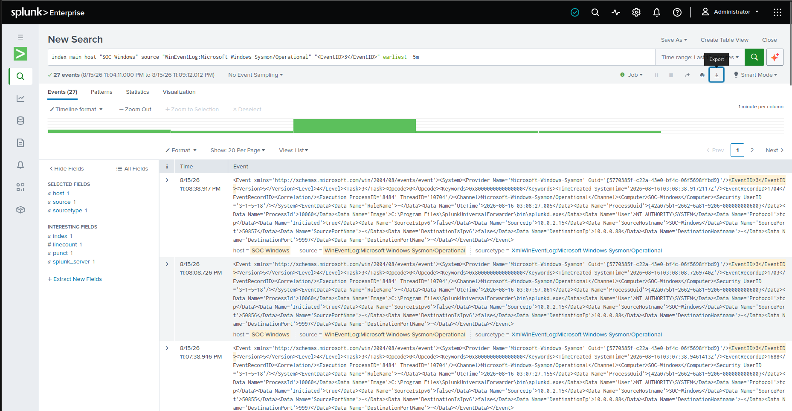
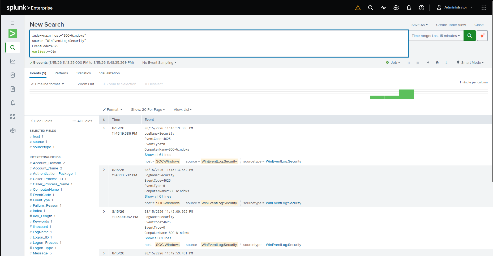
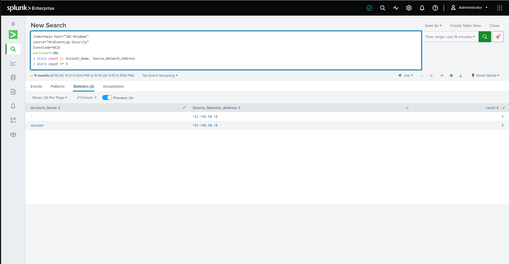

# Home SOC Lab

## Project Overview

This project documents the creation of a Security Operations Center (SOC) home lab designed to build hands-on experience with security monitoring, Windows event logs, endpoint telemetry, SIEM analysis, threat detection, and incident investigation.

The lab uses multiple systems to simulate a small security environment where activity can be generated, logged, forwarded, analyzed, detected, and documented.

Splunk Enterprise runs on an Ubuntu Linux laptop and acts as the central SIEM platform. A Windows 11 virtual machine serves as the monitored endpoint, while a Kali Linux virtual machine is used to generate controlled security activity inside the lab.

---

## Career Goal

This lab was created as part of my path toward becoming a SOC Analyst / Cybersecurity Analyst.

The goal is to develop practical experience with skills commonly used in security operations, including:

- SIEM monitoring
- Windows log analysis
- Endpoint telemetry
- Authentication monitoring
- Threat detection
- Incident investigation
- Splunk SPL
- Network reconnaissance analysis
- Security event correlation
- Technical documentation

---

## Lab Environment

| System | Purpose |
|---|---|
| Ubuntu Laptop | Hosts Splunk Enterprise and serves as the central SIEM system |
| Windows 11 VM | Monitored endpoint and Windows log source |
| Kali Linux VM | Authorized security testing and activity generation |
| Splunk Universal Forwarder | Sends Windows logs to Splunk Enterprise |
| Sysmon | Provides detailed Windows endpoint telemetry |
| Oracle VirtualBox | Hosts the Windows and Kali virtual machines |

---

## Lab Architecture

```text
Kali Linux VM
      |
      | Authorized security testing
      v
Windows 11 VM
      |
      | Windows Security Logs
      | Sysmon Telemetry
      v
Splunk Universal Forwarder
      |
      | Forwarded Logs
      v
Ubuntu Laptop
      |
      | Splunk Enterprise
      v
Search / Detection / Investigation
```

---

# Detection Lab 1: Sysmon Network Connections

The first phase of the lab focused on confirming that Sysmon telemetry from the Windows endpoint was successfully being forwarded into Splunk.

Sysmon Event ID 3 records network connection activity generated by processes running on Windows.

## Splunk Search

```spl
index=main host="SOC-Windows"
source="WinEventLog:Microsoft-Windows-Sysmon/Operational"
"<EventID>3</EventID>"
```

This search confirmed that Splunk was receiving network connection telemetry from the Windows endpoint.

### Skills Practiced

- Sysmon monitoring
- Windows endpoint telemetry
- Splunk log ingestion
- Network connection analysis
- Process-to-network correlation
- SIEM troubleshooting

---

# Detection Lab 2: Repeated Failed SMB Authentication

The second detection exercise focused on repeated failed authentication attempts.

A local Windows test account named:

```text
socuser
```

was created on the Windows VM.

Controlled failed SMB authentication attempts were then generated from the Kali Linux VM.

Windows recorded the failed authentication attempts as:

```text
Security Event ID 4625
```

---

## Initial Event Search

```spl
index=main host="SOC-Windows"
source="WinEventLog:Security"
EventCode=4625
earliest=-30m
```

The search successfully returned the failed authentication activity generated from Kali Linux.

---

## Authentication Analysis

The events were grouped by account name and source IP address:

```spl
index=main host="SOC-Windows"
source="WinEventLog:Security"
EventCode=4625
earliest=-30m
| stats count by Account_Name, Source_Network_Address
```

The results showed:

```text
Account_Name: socuser
Source_Network_Address: 192.168.50.10
Count: 5
```

---

## Detection Query

A threshold was added to identify repeated authentication failures:

```spl
index=main host="SOC-Windows"
source="WinEventLog:Security"
EventCode=4625
earliest=-30m
| stats count by Account_Name, Source_Network_Address
| where count >= 5
```

The query successfully detected five repeated failed authentication attempts against the `socuser` account.

---

## Detection Workflow

```text
Kali Linux
      |
      v
Failed SMB Authentication Attempts
      |
      v
Windows Security Event ID 4625
      |
      v
Splunk Universal Forwarder
      |
      v
Ubuntu Laptop
      |
      v
Splunk Enterprise
      |
      v
SPL Detection Query
      |
      v
Repeated Failed Login Detection
```

---

# Screenshots

## Sysmon Network Telemetry



## Windows Failed Authentication Events



## Failed Login Detection



---

# Skills Demonstrated

Through this lab, I have practiced:

- Building a virtual SOC environment
- Configuring Windows endpoint logging
- Using Sysmon for endpoint telemetry
- Forwarding Windows logs into Splunk
- Hosting Splunk Enterprise on Ubuntu Linux
- Searching security events using SPL
- Investigating Windows Event ID 4625
- Identifying source IP addresses
- Grouping security events using `stats`
- Creating threshold-based detections
- Detecting repeated authentication failures
- Using Kali Linux for controlled security testing
- Using Nmap for service discovery
- Analyzing SMB authentication activity
- Documenting security investigations

---

# Security Testing Scope

All security testing performed in this project was conducted exclusively against systems inside my own controlled lab environment.

The Windows and Kali Linux virtual machines were created specifically for cybersecurity learning, detection engineering, monitoring, and investigation practice.

No external systems were targeted.

---

# Future Lab Expansion

Planned additions include:

- Splunk alerts
- Additional Windows detections
- Suspicious PowerShell monitoring
- Process creation detection
- Account creation monitoring
- RDP authentication monitoring
- Port scan detection
- Windows Defender Firewall logging
- Wireshark packet analysis
- MITRE ATT&CK mapping
- SOC dashboards
- Additional incident reports
- Incident response playbooks
- Additional Windows and Linux endpoints

---

# Project Status

- [x] Configure Ubuntu SIEM host
- [x] Install Splunk Enterprise
- [x] Create Windows 11 VM
- [x] Create Kali Linux VM
- [x] Configure VirtualBox networking
- [x] Install Sysmon
- [x] Install Splunk Universal Forwarder
- [x] Ingest Sysmon logs
- [x] Ingest Windows Security logs
- [x] Analyze Sysmon Event ID 3
- [x] Generate controlled failed authentication attempts
- [x] Detect Windows Event ID 4625
- [x] Build repeated failed-login SPL detection
- [x] Document first SOC incident
- [ ] Create Splunk alerts
- [ ] Build additional detection rules
- [ ] Map detections to MITRE ATT&CK
- [ ] Build SOC dashboards

---

# Author

Igor Barbosa

Cybersecurity student developing practical experience in:

- Security Operations
- SOC Analysis
- SIEM Monitoring
- Threat Detection
- Endpoint Security
- Network Security
- Incident Response# Home SOC Lab

## Project Overview

This project documents the creation of a beginner Security Operations Center (SOC) home lab designed to build hands-on experience with security monitoring, Windows event logs, endpoint telemetry, SIEM analysis, and threat detection.

The lab uses virtual machines to simulate a small security environment where activity can be generated, logged, forwarded, and analyzed.

The current focus is on using Splunk to investigate Windows endpoint activity and create simple detections based on real event data generated inside an isolated lab environment.

---

## Career Goal

This lab was created as part of my path toward becoming a SOC Analyst / Cybersecurity Analyst.

The goal is to gain practical experience with skills commonly used in security operations, including:

- SIEM monitoring
- Windows log analysis
- Endpoint telemetry
- Authentication monitoring
- Threat detection
- Incident investigation
- Splunk SPL
- Network reconnaissance analysis
- Technical documentation
- Security event correlation

---

## Lab Environment

| System | Purpose |
|---|---|
| Windows 11 VM | Endpoint and Windows log source |
| Kali Linux VM | Authorized testing and activity generation |
| Splunk Enterprise | SIEM platform used for log search and detection |
| Splunk Universal Forwarder | Sends Windows logs to Splunk |
| Sysmon | Provides detailed Windows endpoint telemetry |
| Oracle VirtualBox | Hosts the virtual lab environment |

---

## Tools Used

- Oracle VirtualBox
- Windows 11
- Kali Linux
- Splunk Enterprise
- Splunk Universal Forwarder
- Sysmon
- Windows PowerShell
- Windows Security Event Log
- Nmap
- smbclient
- Splunk Search Processing Language (SPL)

---

## Lab Architecture

```text
Kali Linux VM
      |
      | Authorized test activity
      v
Windows 11 VM
      |
      | Windows Security Logs
      | Sysmon Telemetry
      v
Splunk Universal Forwarder
      |
      v
Splunk Enterprise
      |
      v
Searches / Detection Rules / Investigation
Detection Lab 1: Sysmon Network Connections

The first phase of the lab focused on verifying that Sysmon endpoint telemetry was being successfully generated on the Windows endpoint and forwarded into Splunk.

Sysmon Event ID 3 records network connection activity from processes running on the Windows system.

Splunk Search
index=main host="SOC-Windows"
source="WinEventLog:Microsoft-Windows-Sysmon/Operational"
"<EventID>3</EventID>"

This confirmed that Splunk was successfully receiving Sysmon network telemetry from the Windows endpoint.

Skills Demonstrated
Sysmon configuration
Windows endpoint monitoring
Splunk log ingestion
Network connection analysis
Process-to-network correlation
SIEM troubleshooting
Detection Lab 2: Failed SMB Authentication Detection

The next phase of the lab focused on detecting repeated failed authentication attempts.

A local Windows lab account named socuser was created on the Windows VM.

From the Kali Linux VM, controlled failed SMB authentication attempts were generated against the Windows endpoint.

These failed authentication attempts generated Windows Security Event ID 4625 events.

Windows Event ID 4625

Windows Security Event ID 4625 represents:

An account failed to log on

Splunk was used to identify and analyze the authentication failures.

Initial Search
index=main host="SOC-Windows"
source="WinEventLog:Security"
EventCode=4625
earliest=-30m

The search successfully returned the failed login activity generated from the Kali Linux VM.

Detection Query

The following SPL query was created to group failed login attempts by username and source IP address:

index=main host="SOC-Windows"
source="WinEventLog:Security"
EventCode=4625
earliest=-30m
| stats count by Account_Name, Source_Network_Address

A threshold was then added to identify repeated authentication failures:

index=main host="SOC-Windows"
source="WinEventLog:Security"
EventCode=4625
earliest=-30m
| stats count by Account_Name, Source_Network_Address
| where count >= 5
Detection Result

The detection successfully identified repeated authentication failures against the test account.

Example result:

Account_Name: socuser
Source_Network_Address: 192.168.50.10
Count: 5

This demonstrated the full detection workflow:

```text
Kali Linux
    ↓
Failed SMB authentication attempts
    ↓
Windows Security Event ID 4625
    ↓
Splunk Universal Forwarder
    ↓
Splunk Enterprise
    ↓
SPL Detection Query
    ↓
Repeated Failed Login Detection
```

## Screenshots

### Sysmon Network Telemetry


### Windows Failed Authentication Events


### Failed Login Detection


## Skills Demonstrated

Through this lab, I have practiced:

Building a virtual SOC environment
Configuring Windows endpoint logging
Using Sysmon for endpoint telemetry
Forwarding Windows logs into Splunk
Searching security events using SPL
Investigating Windows Event ID 4625
Identifying source IP addresses
Grouping events using stats
Creating threshold-based detections
Detecting repeated authentication failures
Using Kali Linux for controlled security testing
Using Nmap for service discovery
Analyzing SMB authentication activity
Documenting security investigations
Security Testing Scope

All testing performed in this project was conducted inside my own isolated virtual lab environment.

The Windows and Kali Linux virtual machines were created specifically for cybersecurity learning, monitoring, and detection practice.

No external systems were targeted.

Future Lab Expansion

Future additions to this project may include:

Splunk alerts
Additional Windows detection rules
PowerShell activity detection
Suspicious process execution detection
Account creation monitoring
Privilege escalation monitoring
RDP authentication monitoring
Port scan detection
Windows Defender Firewall logging
Wireshark packet analysis
Incident response documentation
SOC investigation playbooks
MITRE ATT&CK mapping
Dashboard creation
Additional Linux log monitoring
Incident Documentation

This repository also includes an incident report template that can be used to document future detections and investigations.

Future incident reports may include:

Repeated failed authentication attempts
Suspicious PowerShell activity
Network reconnaissance
Account creation
Unusual process execution
Possible privilege escalation activity
Project Status

This project is actively being developed as I continue building practical SOC and cybersecurity skills.

Current progress:

 Create Windows VM
 Create Kali Linux VM
 Configure VirtualBox networking
 Install Sysmon
 Install Splunk Enterprise
 Configure Splunk Universal Forwarder
 Ingest Sysmon logs
 Ingest Windows Security logs
 Analyze Sysmon Event ID 3
 Generate controlled failed authentication attempts
 Detect Windows Event ID 4625
 Build failed-login SPL detection
 Create Splunk alerts
 Build additional detection rules
 Create incident reports
 Map detections to MITRE ATT&CK
 Build SOC dashboards
Author

Igor Barbosa

Cybersecurity student focused on developing practical experience in:

Security Operations
SOC Analysis
SIEM Monitoring
Threat Detection
Endpoint Security
Network Security
Incident Response
